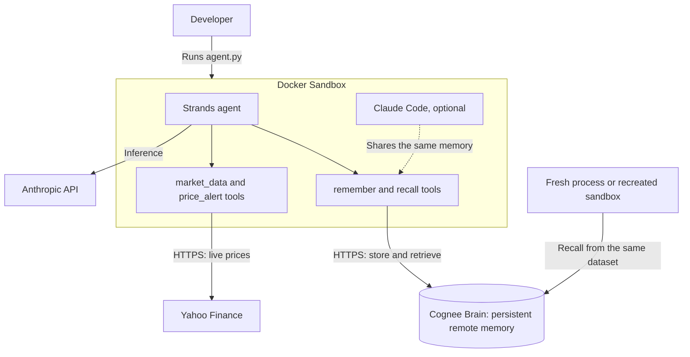

```mermaid
flowchart TD
    D[Developer] -->|Runs agent.py| S
    subgraph S[Docker Sandbox]
        A[Strands agent] --> T[remember and recall tools]
        A --> F[market_data and price_alert tools]
        CC[Claude Code, optional] -.->|Shares the same memory| T
    end
    T -->|HTTPS: store and retrieve| B[(Cognee Brain: persistent remote memory)]
    F -->|HTTPS: live prices| Y[Yahoo Finance]
    A -->|Inference| L[Anthropic API]
    N[Fresh process or recreated sandbox] -->|Recall from the same dataset| B
```
